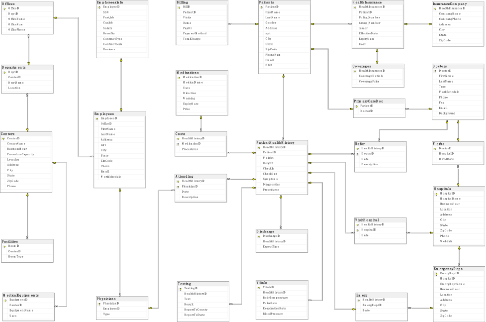

# States-MD-Urgent-Care-Center-Database
Urgent care is a walk-in clinic to treat injuries or illnesses requiring immediate care but not serious enough to require a hospital emergency department visit. With the onset of COVID19, they have been more on demand for testing and simple interventions.

This project will design, implement, and test a database for a national chain of urgent care center, called “States MD Urgent Care Center”. The project will need to investigate further about the typical operations in an urgent care clinic and design database accordingly.

The project will use SQL Server Management Studio to create the database and corresponding scripts. 

## Table of Contents
* [Introduction](#introduction)
* [Design](#design)
* [Implementation](#implementation)
* [Conclusion](#conclusion)

## Introduction
Due to COVID-19, more and more patients go to urgent care centers for testing. Besides, other types of patients are getting more to present in the urgent care center as well. Due to lack of data management such as centers’ information, patients’ information, etc., it’s necessary to have a database to store all such data so that the urgent care center could easily view and manage data. Also, the urgent care center could monitor all patients’ situation and give them early treatment based on patient’s health history.

The project “States MD Urgent Care Center Database” is to manage data and resources  such as employees, patients, centers, billing, etc. for the Urgent Care Center.

28 tables are created to build the structure of the database. There are 5 most important tables: Centers, Employees, Patients, PatientHealthHistory, and Insurance. The detailed information about the structure and relationships will be discussed in the Design session. The database will implement it with random data, and test it with operations such as stored procedures, functions, triggers, transactions and scripts.

## Design
The database design follows the rule of thrid normal form. Also possible business logics and transactions to be considered in the design.

The E/R Diagram shows below.

## Implementation
Create views, stored procedures, user defined functions, triggers and transactions. 

Include scripts to create users with various security levels, password, and roles. 

More details in the [Documentation](https://github.com/HackBL/States-MD-Urgent-Care-Center-Database/blob/main/Documentation.pdf).

## Conclusion
This database design project helps urgent care centers manage data in the system. There are several roles who can directly manipulate the database. All roles are assigned by administrators. 
